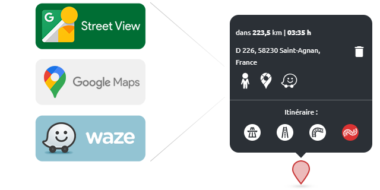

  

This browser extension add some features to the web Calimoto's Tour Planner:
- Links to externals services
- Design changes (like bigger search bar and font size)

## Why this extension?
Being a passionate biker I use the Calimoto mobile app a lot for my rides. I always prepare these rides on the Calimoto web app but this one has some annoying lacks. The service is good enough that I have been subscribed to the paid offer for several years but the rare upgrades of the web platform led me to do it myself.

**For the Calimoto team:** please understand it's not a "hack" of your app, only a way to enhance it.

## How to install it without browser store?
➡ Go to [Releases page](https://github.com/JackNUMBER/calimoto-enhancer/releases) to download the latest source files and follow [these steps](https://gist.github.com/JackNUMBER/a9c0eeeb7b0bafcb5bf377fe79f637a8).
